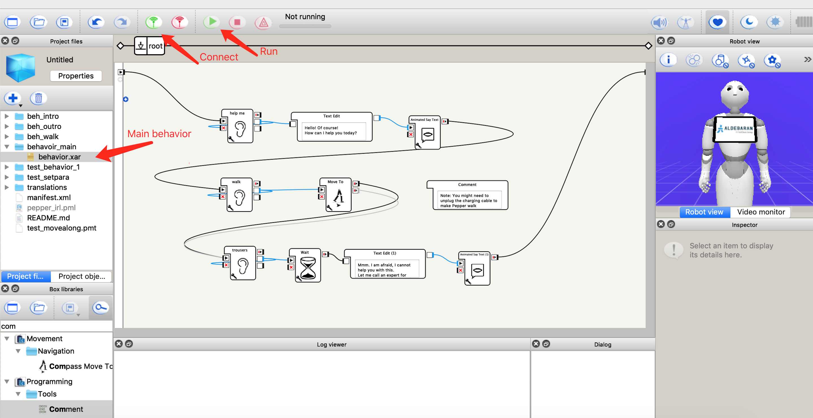

# irl_pepper_choregraphe
 Interacting with Pepper the robot with Choregraphe

## Instruction
1. Make sure the Choregraphe version is 2.5.5. [Link here.](https://www.softbankrobotics.com/emea/en/support/pepper-naoqi-2-9/downloads-softwares/former-versions?os=45&category=98)
2. Open the .pml file to open the project.
3. Connect to the robot.
    - Make sure the robot and the PC are under the same network.
    - If you connect to a virtual robot, note that the speech recognition is not supported.
4. On the left there are many behavior folders. The main program is in folder *behavior_main*.
    - Open the folder *behavior_main*, then the file *behavior.xar*.
5. Run the program by hitting the green play button at the top.

## Dialog walkthrough

---INTRO---  
🧑 Human: Hi Pepper, can you **help me**?  
🤖 Pepper: Hello, of course. How can I help you today?   // Pepper recognizes the phrase "help me"   
🧑 Human: WoW, is super busy today ...  

---WALK---  
🧑 Human: **Walk** with me, Pepper.  
🤖 Pepper: (Walk forwards)   // Pepper recognizes the word "walk"   

---OUTRO---  
...  
🧑 Human: Which shoes fit well together with the dress, **coat and trousers** I chose?  
🤖 Pepper: Mmm. I am afraid, I cannot help you with this. Let me call an expert for help.   // Pepper recognizes the phrase "coat and trousers"   

## Customize the behavior
There are certain parameters that you can change in the diagram according to your wish.  

1. The words that trigger Pepper's recognition:  
    On each SpeechRecognition box, click the wrench icon at the bottom left. There you can input the words that you want Pepper to recognize. (use semicolon to separate single words)
2. The texts that Pepper says:  
    Directly edit in the TextEdit boxs. 
3. The trajectory that Pepper walks:  
    On the MoveTo box, click the wrench icon. There you can edit how far you want Pepper to move. (x being the forward direction, y the perpendicular)
4. The short interval before Pepper speaks:  
    On the Wait box, click the wrench icon. There you can tune the length of the interval.
